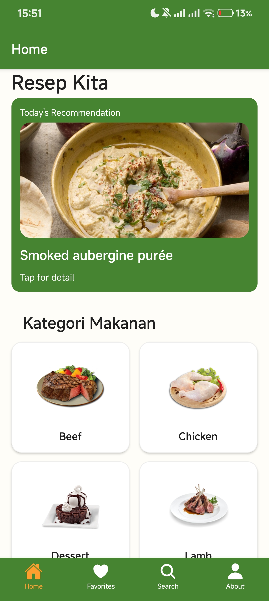
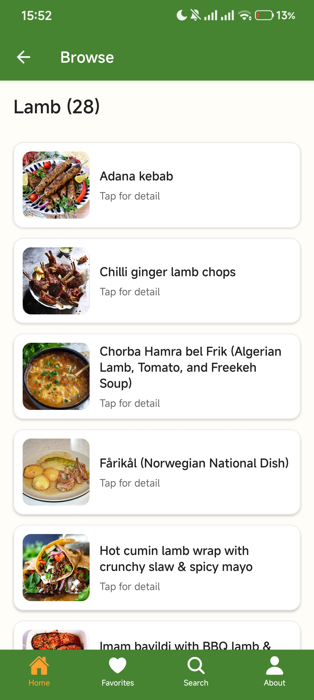
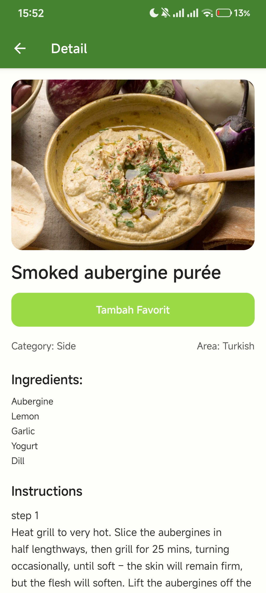
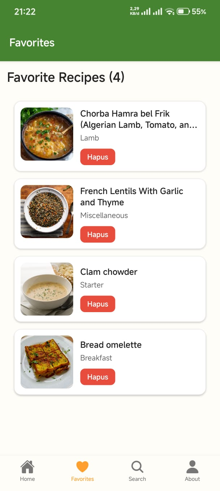
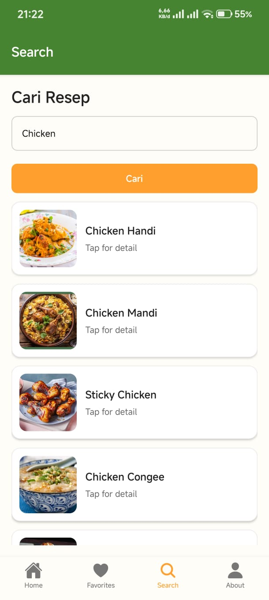
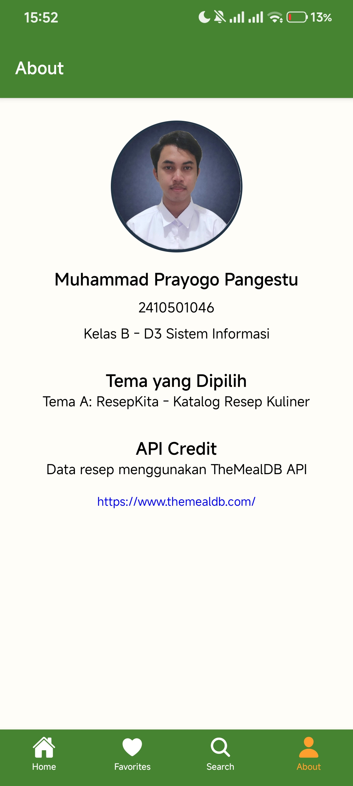

# Resep Kita App - UTS Mobile Lanjut

## Informasi Mahasiswa

- Nama : Muhammad Prayogo Pangestu
- Nim : 2410501046
- Kelas : B
- Tema : A. ResepKita - Katalog Resep Kuliner

## Tech Stack

- React Native — 0.81.5
- Expo — ~54.0.33
- JavaScript — ES6+
- React Navigation — v7
- Zustand — 5.0.12
- TheMealDB — Public REST API

## Cara Install dan Run

- clone project
- npm install
- npx expo start

## Screenshot Aplikasi

Berikut tampilan aplikasi:

### Home Screen

### Browse Screen

### Detail Screen

### Favorites Screen

### Search Screen

### About Screen

## Link Vidio demo

- https://youtu.be/t7eD05Har-0?feature=shared
- https://drive.google.com/drive/folders/1kN_LeAkXrKhv4-5pPGXGKFwDSS54-gOP?usp=sharing

## Penjelasan State Management

Pada project ini untuk state managementnya saya memilih Zustand karena lebih ringan, sederhana, dan mudah untuk implementasinya dibandingkan Redux. Zustand tidak butuh banyak tambahan code sehingga proses pengembangan menjadi lebih cepat dan struktur kode tetap rapi.

Zustand digunakan untuk mengelola data global seperti daftar resep favorit, jadi data dapat diakses dari beberapa screen seperti Home, Detail, dan Favorites tanpa perlu mengirim props secara berulang. Sehingga alur data lebih efisien dan memudahkan pengelolaan state pada aplikasi.

Zustand juga dipilih karena cocok untuk project ini dimana skala aplikasi masih kecil yang butuh solusi state management yang praktis namun tetap efektif.

### Kelebihan Zustand pada project ini:

- Tidak perlu banyak kode tambahan sehingga lebih simpel
- Mudah membuat global state favorit
- Cocok untuk project skala kecil hingga menengah

### Kekurangan:

- Komunitas dan tools belum sebesar Redux
- Untuk project besar biasanya butuh struktur tambahan

## Referensi

1. React Native Documentation  
   https://reactnative.dev/docs/intro-react-native-components

2. React Navigation Documentation  
   https://reactnavigation.org/docs/navigating

3. TheMealDB API Documentation  
   https://www.themealdb.com/api.php

4. Stack Overflow - React Navigation nested navigation  
   https://stackoverflow.com/questions/49826920/how-to-navigate-between-different-nested-stacks-in-react-navigation

5. MDN Web Docs - JavaScript Fetch API  
   https://developer.mozilla.org/en-US/docs/Web/API/Fetch_API/Using_Fetch

## Refleksi

Dalam proses mengerjakan aplikasi ini, saya mengalami beberapa kendala, yang pertema adalah saat tombol back dari detail screen selalu mengarah ke browse screen jika di buka dari card di halaman favorit dan searchscreen, hal ini dikarenakan sebelumnya detail screen berada di homestack sehingga dari faacorit screeen harus navigate ke home baru ke detailscreen. untuk solusinya saya memindahin detailscreen ke root naviigator (AppNavigator) agar navigasi jadi lebih konsisten dan bisa langsung tanpa melalui home.Disini saya dapat mengtetahui tentang bagaimana cara kerja dari navigasi stack dan tabs

kedua saya ada eror di hook reaact saat menggunakan zustand kerena penempatan hooksnya salah urut / tidak tepat, solusinya memindahkan urutan hooks sesuai rules of hooks dan saya dapat mengetahui cara kerja dari state management.

yang ketiga saya juga mengalami masalah saat melakukan push ke GitHub karena terjadi merge conflict yang menyebabkan project error. Saya belajar cara menyelesaikan conflict dengan menggunakan git pull --rebase dan memperbaiki file yang bermasalah.
